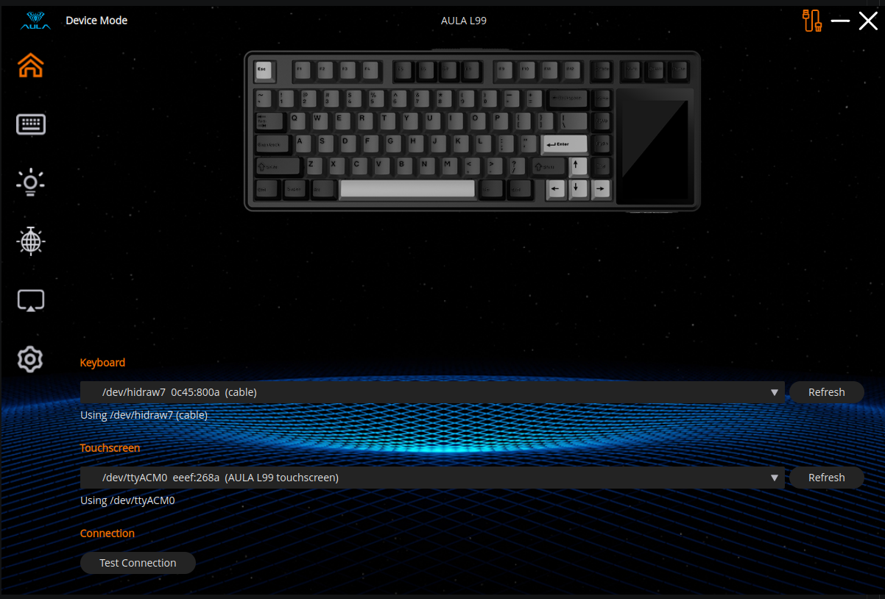
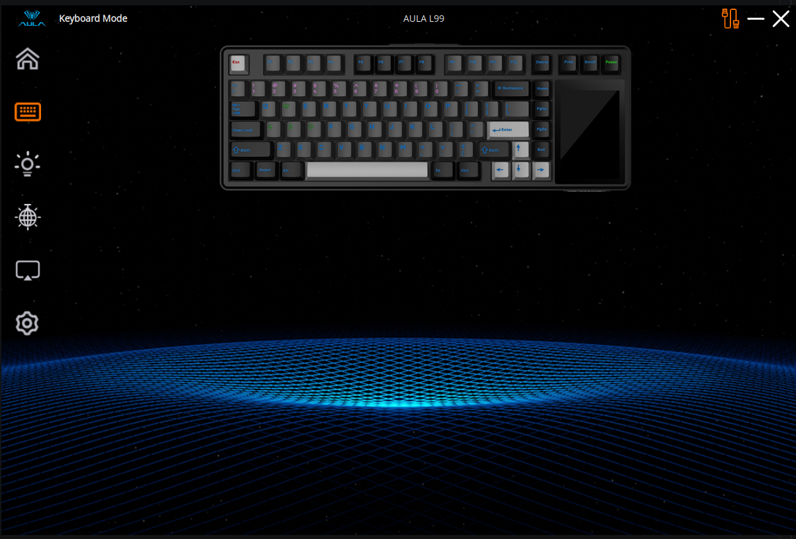
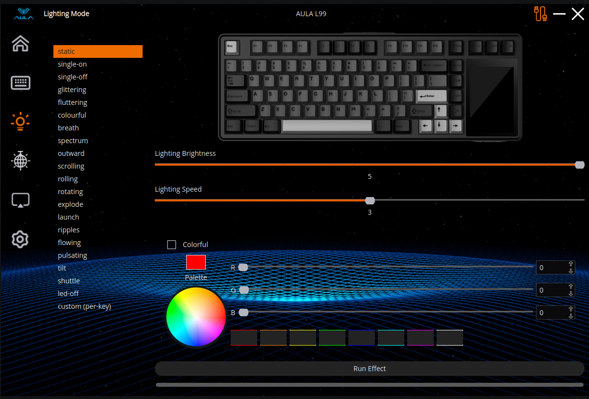
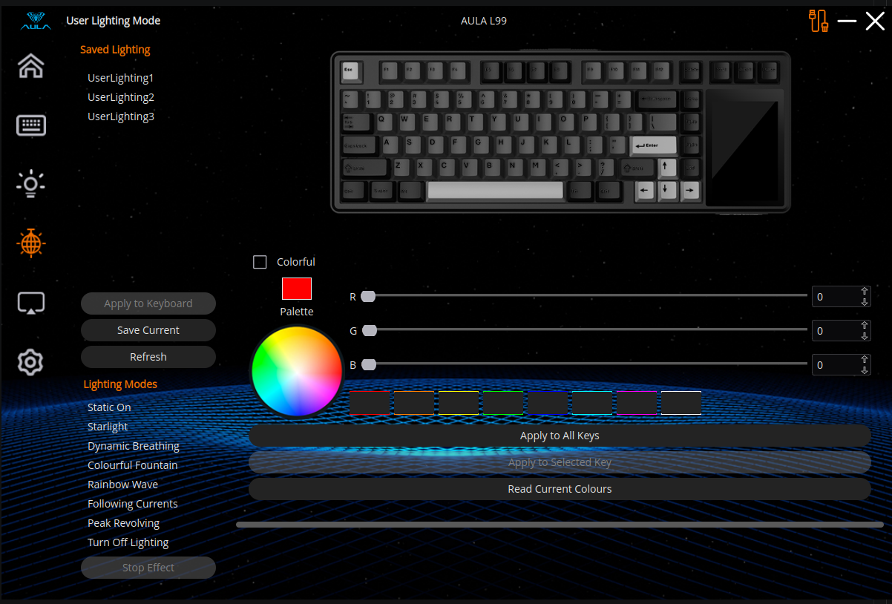
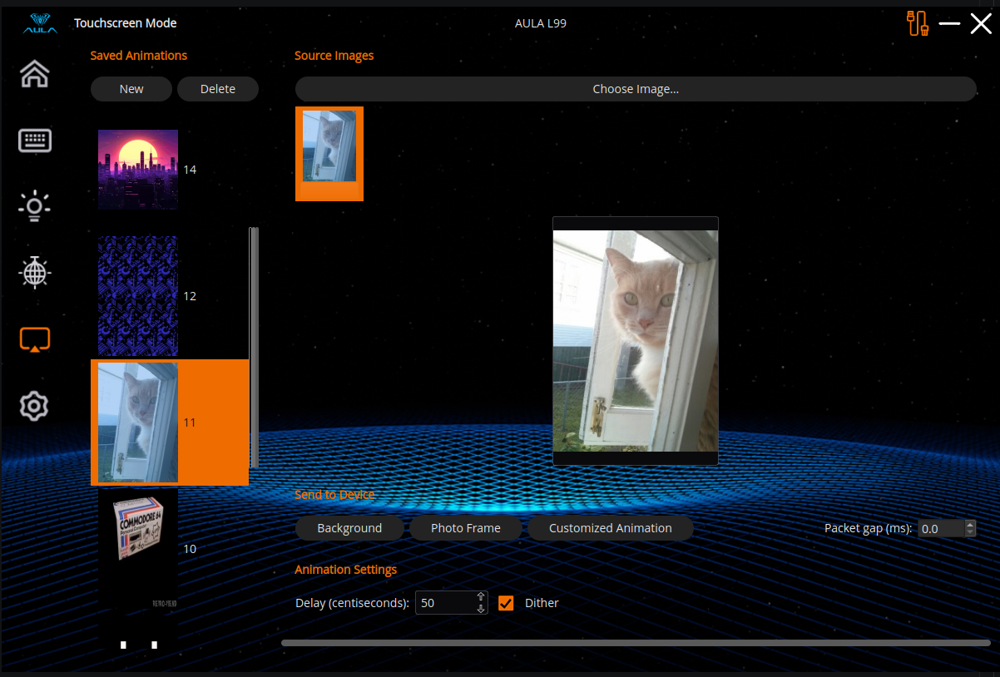
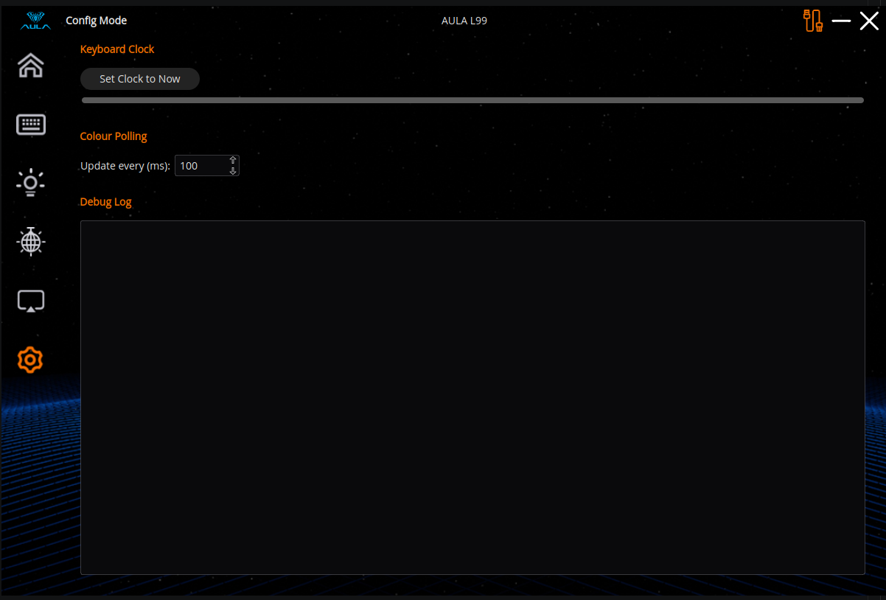

# AULA L99 — Linux Reverse Engineering & Tools

Reverse engineering of the **AULA L99** mechanical keyboard and its built-in
touchscreen, with working Linux tools for everything the vendor's
Windows-only software does over USB: per-key RGB, built-in lighting effects,
host-driven animations, the on-board clock, the touchscreen's system-monitor
and weather readout, its audio spectrum analyser, keyboard settings, and
uploading images and animated GIFs to the panel — plus a PySide6 GUI that
ties it all together.



Everything here was derived from USB captures of the vendor's
`DeviceDriver.exe`, static analysis of its DLLs and firmware updaters, and
byte-level experimentation against real hardware. No vendor code runs on
Linux; no vendor code is required at runtime.

## The hardware

The L99 is really **two independent USB devices** in one chassis:

| Device | IDs | Transport |
|---|---|---|
| Keyboard (vendor channel) | `0C45:800A` wired, `05AC:024F` 2.4G dongle | HID feature reports, interface 3, 64-byte packets |
| Touchscreen | `EEEF:268A` | CDC-ACM USB serial (`/dev/ttyACMn`) |

They share no protocol and no code. One crossover exists: the panel's
CPU/GPU/weather readout is fed through the *keyboard's* HID channel (riding
in the RTC packet), which the keyboard forwards to the panel.

## The tools

All three live under [tools/](tools/) and are pure Python. Each has its own
README with full protocol documentation and usage.

### [tools/aula_l99_hacky/](tools/aula_l99_hacky/README.md) — keyboard CLI

Talks to the keyboard's vendor HID channel via `/dev/hidraw*` (no root
needed with the usual udev ACLs). Confirmed on real hardware:

- Session handshake, per-key RGB **write and read-back** (84 keys)
- All 20 built-in lighting effects, with speed/brightness
- A second, session-less realtime colour-stream path (opcode `0x20`) used
  for host-driven animation
- RTC clock set, carrying the panel's CPU/GPU load & temperature, air
  temperature, forecast highs/lows, weather condition and humidity — each
  field verified by writing a distinctive value and reading the panel
- The audio spectrum feed (opcode `0x78`) driving the panel's analyser —
  the host does the FFT, the keyboard just receives 23 levels
- Settings writes (opcode `0x17`): response time, sleep timer
- `--send-hex` for replaying candidate packets straight from a capture

The protocol (framing, checksums, block layout, timing constraints, and the
gotchas that will corrupt a capture analysis) is documented in its
[README](tools/aula_l99_hacky/README.md), with deeper working notes in
[re_notes/](tools/aula_l99_hacky/re_notes/).

### [tools/aula_l99_screen/](tools/aula_l99_screen/README.md) — touchscreen CLI

Talks to the panel over USB serial (`dialout` group membership suffices).
Confirmed on real hardware:

- **Single-image upload** to the photo-frame and background flash slots
  (any format Pillow reads, auto-resized to 320×480)
- **Animated GIF upload** — building the panel's proprietary GIF container
  from scratch, from frame images, an existing `.gif`, or video frames.
  Currently limited to "safe" colors (`max(R,G,B)` exactly 0 or 255); the
  vendor encoder's dithering for anything else is characterised but not yet
  reimplemented
- `--convert` / `--describe` for building and inspecting the panel's `.bin`
  blobs offline

The GIF container was the hardest single artifact in the project: a
proprietary format with a per-frame RGB565 palette, a run-length encoding
that runs *continuously across row boundaries*, a fallback raw
indexed-bitmap mode for heavily-dithered frames, per-length CRC
initialisation values for the final wire chunk, and a firmware-side content
validator with genuinely strange rules (it tolerates exactly 8 stray bytes
in a padding region; it rejects a foreign pixel in a stripe's interior but
accepts one at a colour boundary). All of it was decoded through 18+
targeted Wireshark captures and dozens of single-byte mutation experiments
against the live panel — the full lab notebook is in the tool's
[README](tools/aula_l99_screen/README.md).

### [tools/aula_l99_gui/](tools/aula_l99_gui/README.md) — PySide6 GUI

A desktop app wrapping both CLIs' protocol modules directly (no
shelling-out), wearing the vendor's own extracted skin artwork. Six tabs:

**Device** — hidraw/serial discovery and selection


**Keyboard** — connection test, all-keys colour, clock set



**Lighting** — the 20 built-in effects with speed/brightness, and a live
preview that mirrors the keyboard's actual LED state



**User Lighting** — per-key colour editing on a rendered keyboard overlay,
plus host-animated effects (breathing, rainbow wave, starlight, …)
streamed at ~17 fps for single keys the firmware can't animate itself



**Touchscreen** — image and GIF upload with live packet-by-packet progress



**Config** — polling and app settings



Supports system-tray/app-indicator mode (`--tray`, `--start-hidden`).

## Quick start

```bash
# GUI (uses uv if present, else .venv, else system python)
./run.sh
./run.sh --tray --start-hidden

# CLIs
cd tools
python3 -m aula_l99_hacky.cli --list          # find the keyboard
python3 -m aula_l99_hacky.cli --color 00FF00  # all keys green
python3 -m aula_l99_screen.cli --list         # find the panel
python3 -m aula_l99_screen.cli --upload picture.png

# syntax-check everything under tools/
./compile.sh
```

The GUI needs `PySide6` and `pillow`; the CLIs are stdlib-only. See
[tools/aula_l99_gui/README.md](tools/aula_l99_gui/README.md) for venv/`uv`
setup.

**Permissions:** the keyboard needs read/write on its hidraw node (a udev
rule granting the logged-in user an ACL is typical); the touchscreen needs
membership in the `dialout` group. No root otherwise.

## How the reverse engineering was done

1. **USB captures** — the vendor's `DeviceDriver.exe` running under Windows
   with USBPcap/Wireshark, one isolated action per capture. The raw
   captures are kept in [wireshark_dumps/](wireshark_dumps/) (named for
   what was being tested: `save_to_gif_*.pcapng`, `response_time_1.pcapng`,
   `system_monitor_2.pcapng`, …) so every claim in the protocol docs can be
   re-verified against its source.
2. **Byte-for-byte reproduction** — every packet builder in both
   `protocol.py` modules reproduces the vendor app's own packets exactly,
   checked against the captures before ever touching hardware.
3. **Hardware mutation experiments** — for the parts no capture could
   explain (the GIF encoding, the panel's content validator), known-good
   blobs were re-uploaded with controlled single-byte changes and the
   panel's behaviour photographed and compared. The screen README reads as
   the lab notebook for this.
4. **Static analysis** — the vendor package under
   [Windows/AULA L99/](Windows/AULA%20L99/) (config, layouts, language
   tables, skins, fonts, the qt-tool DLLs) and the firmware updaters were
   disassembled where captures weren't enough: `pic_scan.dll` for the image
   pipeline, and the Enigma-Protector-wrapped screen firmware updater
   (unpacked sections in [documentation/Firmware/](documentation/Firmware/))
   for a possible custom-code path to the panel's LT7689 controller.
   Working notes live in each tool's `re_notes/` directory.

### What's still open

- The GIF encoder's dithering algorithm (error-diffusion-like, per-channel;
  characterised but not reimplemented) — the blocker on arbitrary-colour
  GIF uploads
- A general formula for the final-chunk CRC init values (currently a
  per-length lookup table solved from captures)
- The panel's content-validation mechanism (its behaviour is mapped across
  ~20 hardware data points; the algorithm isn't decoded)
- Keyboard macros; the 2.4G dongle path (constants inherited from the AULA
  F75 MAX, never tested); touchscreen touch input, brightness and power
- One unidentified flash slot at `0x04200000`

## Repository layout

```
tools/aula_l99_hacky/    keyboard HID protocol + CLI (+ re_notes/)
tools/aula_l99_screen/   touchscreen serial protocol + CLI (+ re_notes/)
tools/aula_l99_gui/      PySide6 GUI over both (+ vendor skin assets)
wireshark_dumps/         the USB captures everything was derived from
Windows/                 vendor software package + firmware updaters (analysis source)
documentation/Firmware/  unpacked PE sections of the screen firmware updater
test_images/             image/GIF test fixtures
run.sh                   launch the GUI
compile.sh               byte-compile everything under tools/
CHANGELOG.md             detailed, versioned history of the whole effort
```

## Related work

The touchscreen's *serial widget* protocol was independently documented in
[Salamor/aula-l99-open-widgets](https://github.com/Salamor/aula-l99-open-widgets);
this project covers everything that project doesn't — the keyboard's HID
channel and the panel's image/GIF upload path.

## Disclaimer

Not affiliated with or endorsed by AULA. Everything here was derived by
observing a device its owner bought; use at your own risk. Uploads to the
touchscreen write to its flash — interrupting one mid-transfer can freeze
the panel until a restart.
